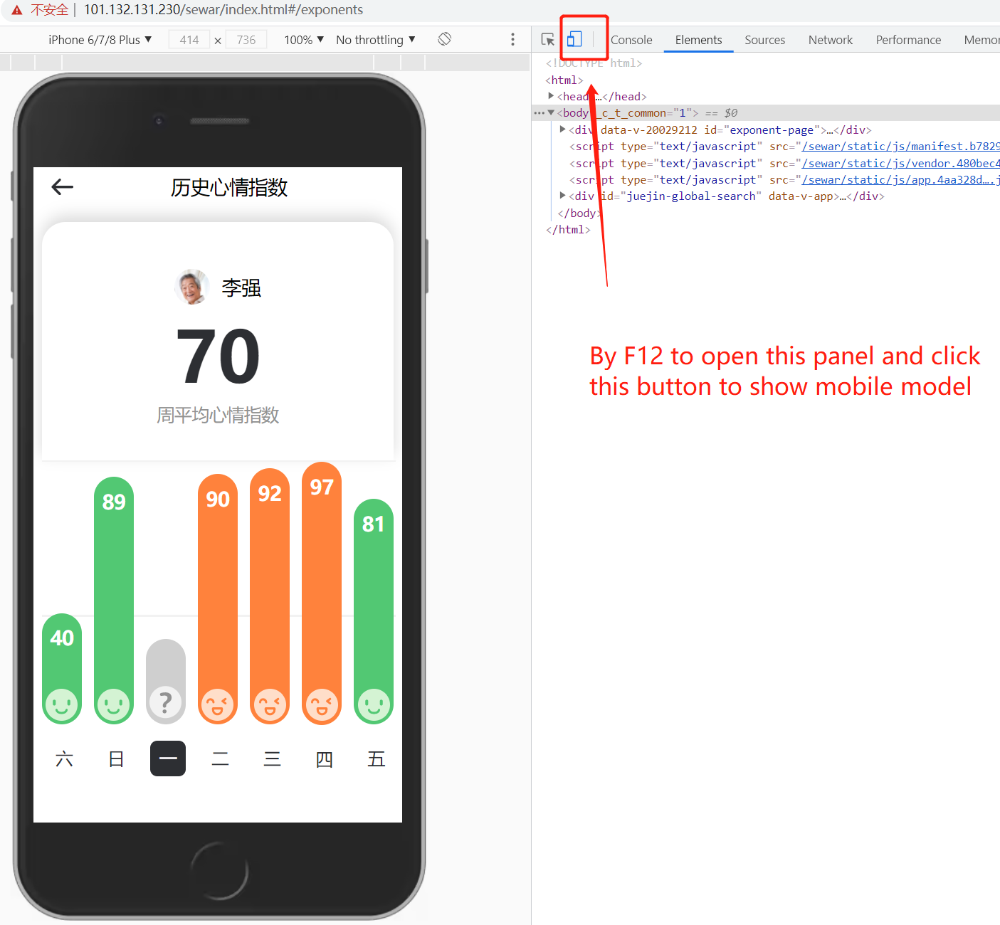
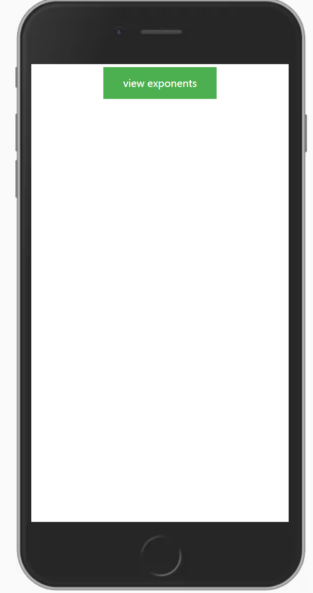
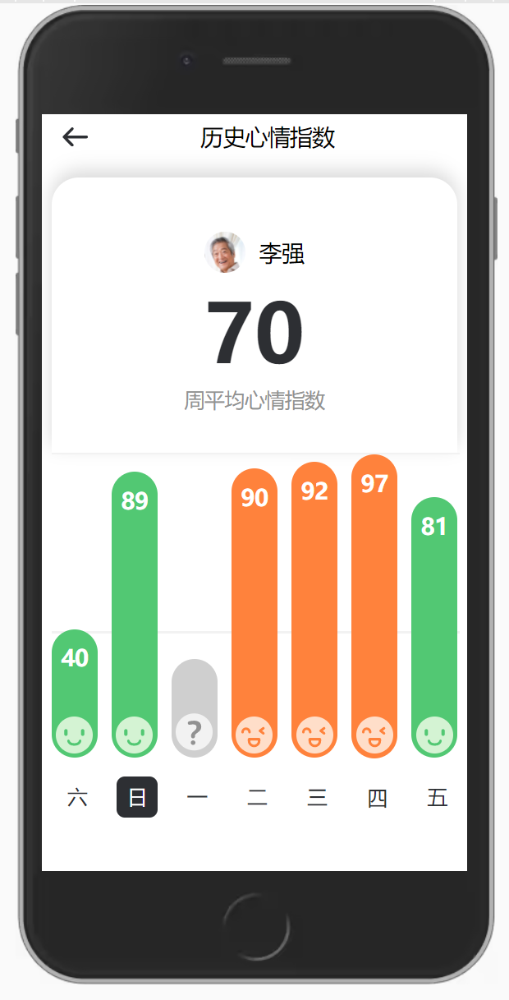

# Mobile App Design and Implementation Test Project
## Introduction

* Project link:  [`http://www.sewar.top/sewar/index.html`](http://www.sewar.top/sewar/index.html)

  * If the website is temporarily unable to access, please visit the IP address： [`https://101.132.131.230/sewar/index.html`](https://101.132.131.230/sewar/index.html)

  * tip: The project is designed as the mobile，use the F12 to open the debugging tool to view the mobile display style

    

* Home Page only Show a button，Click the button to enter the Exponents page

  

* Exponents Page:

  

## Build Setup

``` bash
# install dependencies
npm install

# serve with hot reload at localhost:8080
npm run dev

# build for production with minification
npm run build

```

* Recommended domestic Taobao mirror:
  (Using npm: err! Failed at the node-script @ xxx postInstall Script)

``` bash
# install cnpm
npm i -g cnpm --registry=https://registry.npm.taobao.org

# serve with hot reload at localhost:8080
cnpm run dev
```

## Q&A

* Q：What are the technologies/framework you will use? 
  * A：The project uses Vue2.x + WebPack3.x constructed single page applications
* Q：Why do you select those technologies?
  * A：Vue.js is a gradual framework for building user interfaces，Use Vue.js to quickly build applications, and you can realize rapid development of small projects
* Q：How do you provide the updated version quickly to the customer？
  * A：use `cnpm run build` to build project. After building a project, you can immediately release the update version immediately after the static resource is up to the web service nginx.


## 3rd party library

* Dependency used in the project：
  * `vue`：
    * Vue 是一套用于构建用户界面的 渐进式框架 。
    * 与其它大型框架不同的是，Vue 被设计为可以自底向上逐层应用。
    * 使用 Vue 可以快速构建应用，并可以实现小项目的快速开发
  * `babel-core`: 
    * 作用：把 js 代码分析成 ast ，方便各个插件分析语法进行相应的处理。
  * `babel-loader`: 
    * 作用是在Webpack打包的时候，用Babel将ES6的代码转换成ES5版本的
  * `babel-polyfill`: 
    * 作用：Babel 包含一个可自定义的 regenerator runtime 和 core-js 的 polyfill。 它会仿效一个完整的 ES2015+ 环境，并意图运行于一个应用中而不是一个库/工具。
  * `babel-preset-env`:  
    * 在使用preset-env之前，babel是无法认识ES6+代码的，该插件主要用于认读 ES6+ 代码
  * `babel-preset-stage-3`:
  * `cross-env`: 
    * 作用：提供一个设置环境变量的scripts，让你能够以unix方式设置环境变量，然后在windows上也能兼容运行。
  * `css-loader`: 
    * 作用：将css文件打包到js中, 常常配合style-loader一起使用，将css文件打包并插入到页面中
  * `file-loader`: 
    * 作用：帮助webpack打包处理一系列的图片文件；比如： .png 、 .jpg 、.jepg 等格式的图片；
    * 使用 file-loader 打包图片的结果：使用file-loader打包的图片会给每张图片都生成一个随机的hash值作为图片的名字
  * `node-sass`: 
    * 作用：将Node.js绑定到LibSass, 允许用户快速将.scss文件本地编译为css，并通过连接中间件自动编译。
  * `sass-loader`: 
    * 作用：帮助webpack打包scss文件
  * `vue-loader`:
    * 作用：解析和转换 .vue 文件，提取出其中的逻辑代码 script、样式代码 style、以及 HTML 模版 template，再分别把它们交给对应的 Loader 去处理
  * `vue-style-loader`: 
    * 作用：往 dom 里面插入一个 style 标签去让样式生效
  * `vue-template-compiler`: 
    * 作用：用于将 Vue 2.0 模板预编译为渲染函数（template => ast => render） ，以避免运行时编译开销和 CSP 限制。
  * `webpack`: 
    * 作用：Webpack 是一个前端资源的打包工具，它可以将js、image、css等资源当成一个模块进行打包
  * `webpack-dev-server`: 
    * webpack-dev-server是webpack官方提供的一个小型Express服务器。
    * 使用它可以为webpack打包生成的资源文件提供web服务
    * 主要提供两个功能：
      - 为静态文件提供服务
      - 自动刷新和热替换
